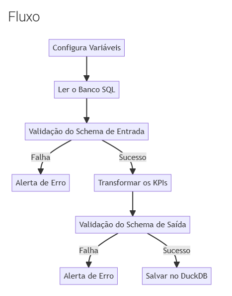
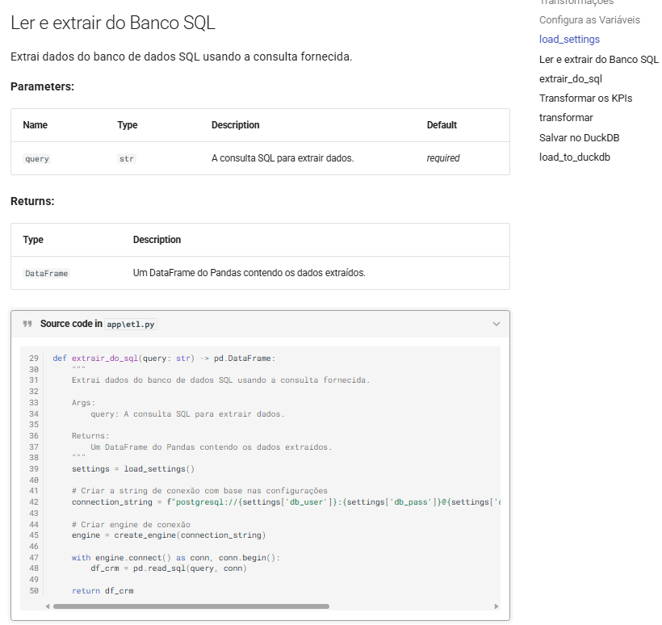

# Workshop Data Quality : ETL com Pydantic e Pandera

Este projeto de Engenharia de Dados tem como objetivo assegurar a qualidade e a estrutura dos dados por meio de um processo de ETL. Os dados são extraídos de tabelas no PostgreSQL, passam por transformações e são carregados em um banco de dados DuckDB, garantindo a integridade. Além disso, o projeto conta com uma esteira de CI que executa testes unitários para validar o código, assegurando conformidade com as regras de negócio. Este workshop é conduzido pela Jornada de Dados.


## 🚀 Features

- Validação de dados com Pandera
- Operações em banco de dados com SQLAlchemy e DuckDB
- Testes automatizados com pytest
- Documentação com MkDocs

## 🏗️ Estrutura do Projeto

```
workshop-data_quality/
├── app/            # Application source code
├── docs/           # Documentation files
├── sql/            # SQL scripts and queries
├── test/           # Test files
├── pyproject.toml  # Project configuration and dependencies
└── README.md       
```



## 📚 Documentação

A documentação do projeto é gerada utilizando MkDocs e pode ser acessada ao executar o seguinte comando:
```bash
poetry run task doc
```

Isso iniciará um servidor local em http://localhost:8000, onde você poderá visualizar a documentação. Como no exemplo abaixo:




## 📋 Pré-requisitos

- Python 3.11 or higher
- Poetry for dependency management

## 🛠️ Instalação

1. Clone the repository:
```bash
git clone git@github.com:idfelipemalatesta/workshop-data_quality.git
cd workshop-data_quality
```

2. Install dependencies using Poetry:
```bash
poetry install
```

3. Activate the virtual environment:
```bash
poetry shell
```


## 🚀 Usage

- Run ETL:
```bash
poetry run python app/etl.py
```


## 🧪 Testes

Execute o conjunto de testes:
```bash
poetry run task test
```